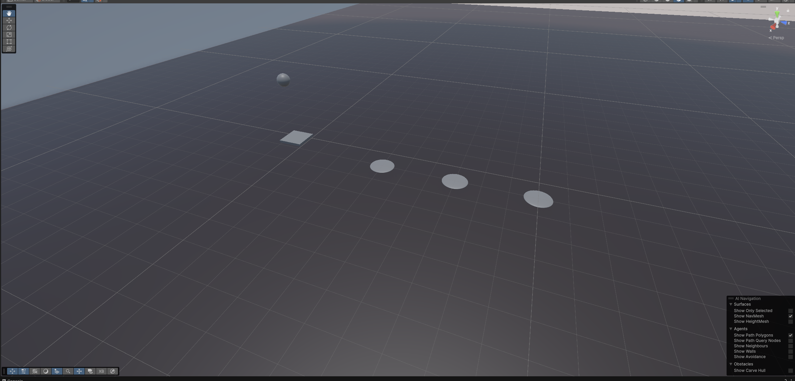
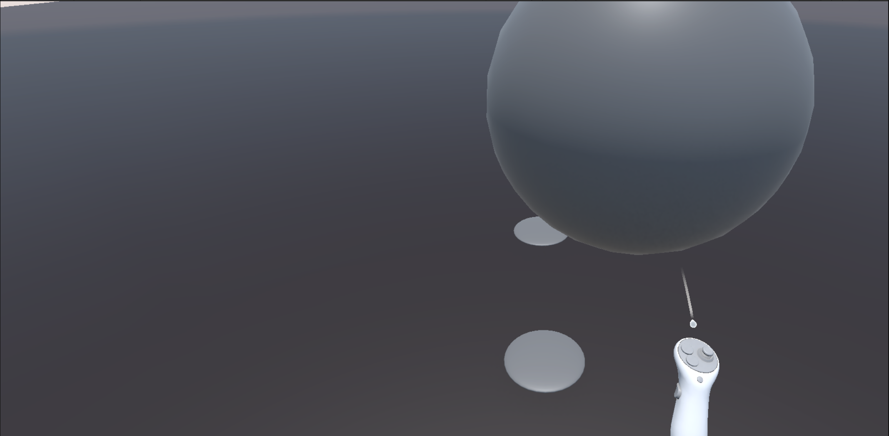
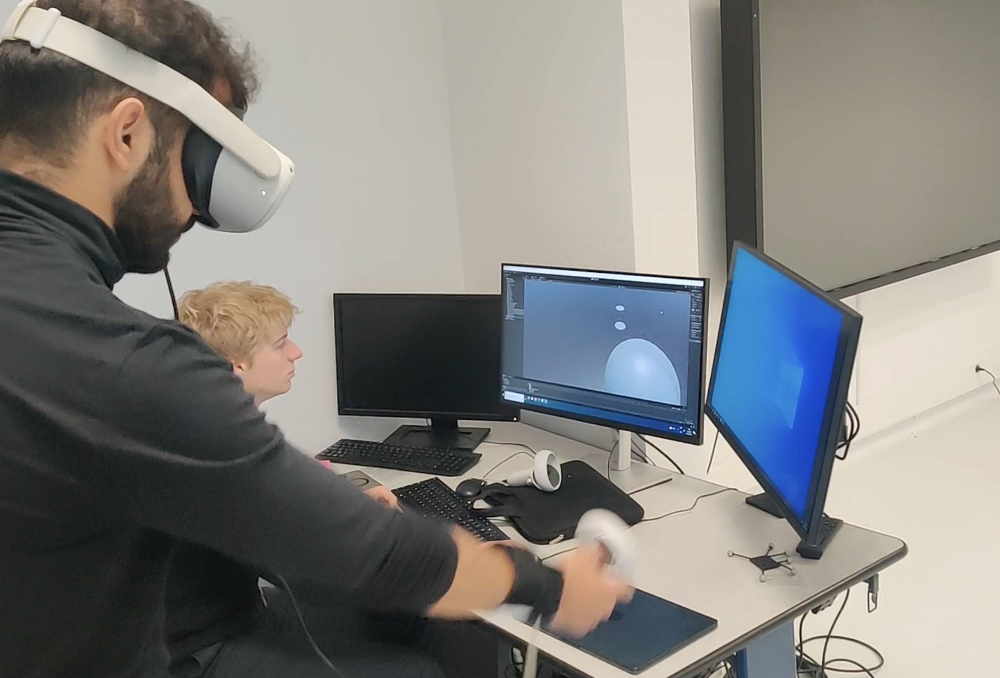

# Virtual Throwing & Haptic Feedback for Distance Perception in AR
## Demo

Here’s the virtual throwing setup in Unity:

*Top-down view of the AR throwing experiment setup.*

*User’s perspective holding the virtual ball using Oculus Quest controller.*

[▶️ Watch the 15s experiment video on Google Drive](https://drive.google.com/drive/folders/1azJ6gl1GO33FbOFV-vRY1kKtFGCWoRXl?usp=share_link)

**Research Project — PRONTO @ IMT Atlantique**  
*Team members: Achraf Essaleh, Gautier Tandeau de Marsac, Marc Duboc*

**Supervisor: Etienne Peillard**

This repository presents a group research project.  
**My main roles:**  
- Reading and synthesizing research articles to understand AR, haptics, and distance perception  
- Designing and building the complete Unity experiment scene from scratch  
- Running the data collection, preprocessing, and all statistical analyses  

## Objective

This project investigates how haptic feedback — specifically mass and vibration — can improve distance perception during virtual throwing tasks in augmented reality (AR). The goal is to determine whether tactile cues help users better estimate egocentric distances, which are often underestimated in AR environments.

## Experimental Setup

- Hardware: Oculus Quest 2 headset and controllers
- Unity Scene: Designed from scratch using Unity's XR Toolkit, including:
  - XR Rig configuration for head and hand tracking
  - Virtual ball throwing mechanism
  - Toggleable vibration system (left/right hand via A/X buttons)
  - Collision detection for precise impact logging
  - CSV logging of each throw’s metadata:
    - Real-time and elapsed time
    - Start and impact positions
    - Throwing velocity
    - Distance to the target
    - Active condition (mass, vibration, both, or control)

## Data Collection

- Participants: 20 total
- Protocol:
  - Each participant completed 8 experimental conditions at three distances (4 m, 7 m, 12 m)
  - 24 labeled throws per participant were selected (3 per condition per distance)
  - Throws used for warm-up or trials were excluded via a manual mapping file
- Conditions:
  - Control (no mass, no vibration)
  - Vibration only (10 Hz or 20 Hz)
  - Mass only (100 g or 200 g)
  - Combined mass and vibration

## Statistical Analysis

All analyses were performed in Python using pandas, scipy, seaborn, and pingouin.

1. Preprocessing:
   - Concatenation and filtering of raw CSVs
   - Manual selection of valid throws using combined_selected_conditions.csv

2. Error Metric:
   - Absolute error was calculated as |DistanceImpact - TargetDistance|

3. Normality Testing:
   - Shapiro–Wilk test was applied to the error distribution of each condition
   - At least one condition failed the normality test, so ANOVA was not used

4. Friedman Test:
   - Non-parametric test for repeated measures
   - Significant differences were found across the 8 conditions (p < 0.001)

5. Post-hoc Analysis:
   - Wilcoxon signed-rank test for pairwise comparisons
   - Bonferroni correction was applied to control the family-wise error rate

## Visualization

- Boxplots: Show the distribution of absolute errors across conditions for each distance
- Bar plots: Show mean error and standard deviation across conditions

These graphs helped identify which combinations of mass and vibration led to improved precision.

## Results Summary

- Mass improved precision across all distances
- Vibration alone had a limited effect
- Combining mass and vibration produced the best results overall
- Participants reported improved control and realism with haptic feedback

## Repository Structure

├── Assets/
│   └── Scripts/              # Unity C# scripts (logger, vibration toggle, etc.)
├── Scenes/                   # Unity scene for virtual throwing
├── data/
│   ├── raw/                  # Raw CSV files (one per participant) Note: Raw participant data files are not included in this repository for privacy reasons. Please contact me if you need access for research purposes.
│   ├── combined_selected_conditions.csv
│   └── analyse_lancers_table.csv
├── analysis/
│   ├── analyse_lancers.py
│   ├── analyse_lancers.ipynb
│   └── posthoc_results.csv
├── docs/
│   ├── pronto_project_brief.pdf
│   ├── research_article_pronto.pdf
│   └── pronto_oral_presentation.pdf
├── README.md

### Supplementary Documents

You can find all project deliverables and related resources in the [`docs/`](docs/) folder:

- [`pronto_project_brief.pdf`](docs/pronto_project_brief.pdf) – Project specification/brief (French)
- [`research_article_pronto.pdf`](docs/research_article_pronto.pdf) – Research article (English)
- [`pronto_oral_presentation.pdf`](docs/pronto_oral_presentation.pdf) – Oral presentation (slides, English)

## Notes

- The Unity scene is functional and ready for experimentation
- Python scripts are documented 
- All statistical steps are automated 
- Designed as part of the PRONTO project at IMT Atlantique (2025)
